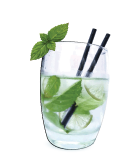
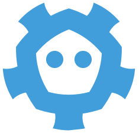
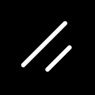
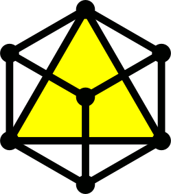
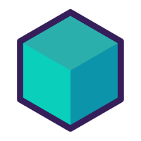
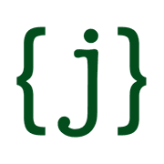
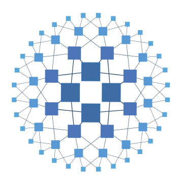
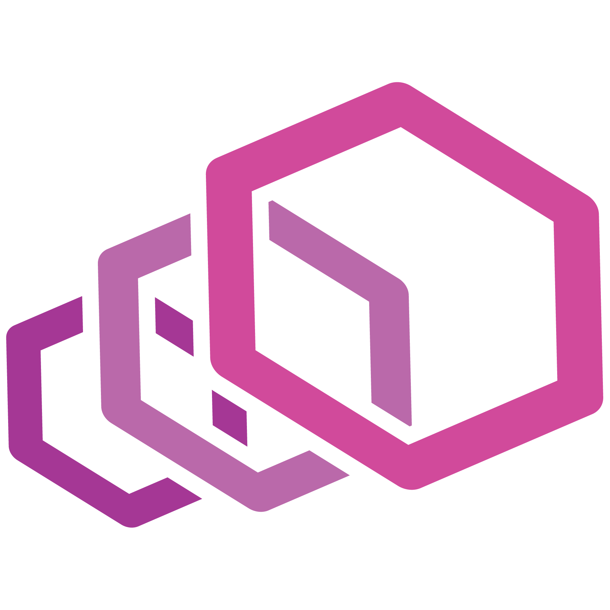

<table align=center>
  <tr>
    <td align=center><a href="https://maxbarsukov.ru/" target="_blank">
      🌐 maxbarsukov.ru
    </a></td>
    <td align=center><a href="https://t.me/maxbarsukov" target="_blank">
      
       @maxbarsukov
    </a></td>
    <td align=center><a href="mailto:maxbarsukov@bk.ru" target="_blank">
      📧 maxbarsukov@bk.ru
    </a></td>
    <td align=center><a href="https://profiles.maxbarsukov.ru" target="_blank">
      👥 etc.
    </a></td>
  </tr>
</table>

<h3 align="center">👋 Hi! I'm Max Barsukov</h3>

I'm a passionate fullstack developer who has been putting bugs into software since 2019.\
Currently pursuing a bachelor’s degree in *System and Application Software* at [ITMO University](https://en.itmo.ru/).

* 📝 You can view my resume at [cv.maxbarsukov.ru](https://cv.maxbarsukov.ru/)
* 💬 Ask me about anything in [issues](https://github.com/maxbarsukov/maxbarsukov/issues) under this repo

<h4>A few projects I've made:</h4>

* [🍿 `MyFilmList`](https://github.com/maxbarsukov/MyFilmList) is a social networking app for tracking movies, allowing you to share thoughts and discover new favorites.
* [🌱 `RadishDB`](https://github.com/maxbarsukov/radish-db) is an in-memory distributed key-value store that prioritizes consistency over availability by implementing [Raft](https://raft.github.io/).
* [🧙 `tollowy-api`](https://github.com/maxbarsukov/tollowy-api) is a REST API built for [**@Followy-Dev**](https://github.com/Followy-Dev) to update and improve the backend part of online social media.
* [😴 `sleepy`](https://github.com/maxbarsukov/sleepy) provides a smart device designed to monitor sleep quality, that can wake you up during REM sleep stage.
* [🦩 `waddle`](https://github.com/maxbarsukov/waddle) is a strongly-typed object-oriented toy programming language with type inference, inspired by Kotlin and Ruby.
* [🦎 `yaframework`](https://github.com/maxbarsukov/yaframework) is a Ruby microframework, providing a DSL for quickly creating web applications with minimal effort.
* [☦️ `l7.X.l7`](https://github.com/maxbarsukov/l7.X.l7) is an orthodox PHP transpiler made just for fun.

<h3 align="left">🧰 Toolbox</h3>

<table>
  <tr>
    <td align=center><b>Java</b></td>
    <td style="width:290px">
      &nbsp;
      &nbsp;
      &nbsp;
      &nbsp;
      &nbsp;
      
       
      &nbsp;
      &nbsp;
      &nbsp;
      &nbsp;
      &nbsp;
      
    </td>
    <td align=center><b>Infrastructure</b></td>
    <td>
      &nbsp;
      &nbsp;
      &nbsp;
      
       
      &nbsp;
      &nbsp;
      &nbsp;
      
    </td>
  </tr>
  <tr>
    <td align=center><b>Ruby</b></td>
    <td>
      &nbsp;
      &nbsp;
      &nbsp;
      &nbsp;
      &nbsp;
      
    </td>
    <td align=center><b>CI/CD</b></td>
    <td>
      &nbsp;
      &nbsp;
      &nbsp;
      
    </td>
  </tr>
  <tr>
    <td align=center><strong>Frontend</strong></td>
    <td>
      &nbsp;
      &nbsp;
      &nbsp;
      &nbsp;
      &nbsp;
      
       
      &nbsp;
      &nbsp;
      &nbsp;
      &nbsp;
      &nbsp;
      
    </td>
    <td align=center><b>Observability</b></td>
    <td>
      &nbsp;
      &nbsp;
      &nbsp;
      
       
      &nbsp;
      &nbsp;
      &nbsp;
      
    </td>
  </tr>
  <tr>
    <td align=center><strong>Databases</strong></td>
    <td>
      &nbsp;
      &nbsp;
      &nbsp;
      &nbsp;
      &nbsp;
      
    </td>
    <td align=center><b>Test Automation</b></td>
    <td>
      &nbsp;
      &nbsp;
      &nbsp;
      
    </td>
  </tr>
  <tr>
    <td align=center><b>API</b></td>
    <td>
      &nbsp;
      &nbsp;
      &nbsp;
      &nbsp;
      &nbsp;
      
    </td>
    <td align=center><strong>Other</strong></td>
    <td>
      &nbsp;
      &nbsp;
      &nbsp;
      <a href="https://crystal-lang.org/" target="_blank" rel="noreferrer">
        <picture>
          <source
            srcset="icons/crystal-white.svg"
            media="(prefers-color-scheme: dark)"
          />
          <source
            srcset="icons/crystal.svg"
            media="(prefers-color-scheme: light), (prefers-color-scheme: no-preference)"
          />
          
        </picture>
      </a>
    </td>
  </tr>
  <tr>
    <td align=center><b>Middleware</b></td>
    <td>
      <a href="https://kafka.apache.org/" target="_blank" rel="noreferrer">
        <picture>
          <source
            srcset="icons/apachekafka-dark.png"
            media="(prefers-color-scheme: dark)"
          />
          <source
            srcset="icons/apachekafka-light.svg"
            media="(prefers-color-scheme: light), (prefers-color-scheme: no-preference)"
          />
          
        </picture>
      </a>&nbsp;
      &nbsp;
      &nbsp;
      &nbsp;
      <a href="https://traefik.io/" target="_blank" rel="noreferrer">
        <picture>
          <source
            srcset="icons/traefik-dark.png"
            media="(prefers-color-scheme: dark)"
          />
          <source
            srcset="icons/traefik-light.png"
            media="(prefers-color-scheme: light), (prefers-color-scheme: no-preference)"
          />
          
        </picture>
      </a>&nbsp;
      
    </td>
    <td align=center><strong>Tools</strong></td>
    <td>
      &nbsp;
      <a href="https://www.gnu.org/software/bash/" target="_blank" rel="noreferrer">
        <picture>
          <source
            srcset="icons/bash-white.svg"
            media="(prefers-color-scheme: dark)"
          />
          <source
            srcset="icons/bash.svg"
            media="(prefers-color-scheme: light), (prefers-color-scheme: no-preference)"
          />
          
        </picture>
      </a>&nbsp;
      &nbsp;
      <a href="https://github.com/" target="_blank" rel="noreferrer">
        <picture>
          <source
            srcset="icons/github-light.svg"
            media="(prefers-color-scheme: dark)"
          />
          <source
            srcset="icons/github.svg"
            media="(prefers-color-scheme: light), (prefers-color-scheme: no-preference)"
          />
          
        </picture>
      </a>
    </td>
  </tr>
</table>

<h3 align="left">📊 Statistics</h3>

<table>
  <tr>
    <td align="center">
      <a href="https://github.com/maxbarsukov">
        <picture>
          <source
            srcset="https://github-readme-stats-bis1chka3-maxbarsukovs-projects.vercel.app/api?username=maxbarsukov&show_icons=true&include_all_commits=true&count_private=true&private=true&hide=contribs&hide_border=true&custom_title=GitHub%20Stats&theme=github_dark"
            media="(prefers-color-scheme: dark)"
          />
          <source
            srcset="https://github-readme-stats-bis1chka3-maxbarsukovs-projects.vercel.app/api?username=maxbarsukov&show_icons=true&include_all_commits=true&count_private=true&private=true&hide=contribs&hide_border=true&custom_title=GitHub%20Stats"
            media="(prefers-color-scheme: light), (prefers-color-scheme: no-preference)"
          />
          
        </picture>
      </a>
    </td>
    <td align="center">
      <a href="https://github.com/maxbarsukov?tab=repositories">
        <picture>
          <source
            srcset="https://github-readme-stats-bis1chka3-maxbarsukovs-projects.vercel.app/api/top-langs/?username=maxbarsukov&layout=compact&langs_count=6&hide_border=true&hide=Jupyter%20Notebook&theme=github_dark"
            media="(prefers-color-scheme: dark)"
          />
          <source
            srcset="https://github-readme-stats-bis1chka3-maxbarsukovs-projects.vercel.app/api/top-langs/?username=maxbarsukov&layout=compact&langs_count=6&hide=Jupyter%20Notebook&hide_border=true"
            media="(prefers-color-scheme: light), (prefers-color-scheme: no-preference)"
          />
          
        </picture>
      </a>
    </td>
  </tr>
</table>

 
<b>👀 view more...</b>

   
  <table>
    <tr>
      <td>
              
      </td>
    </tr>
    <tr>
      <td>
        <picture>
          <source
            srcset="https://github-profile-trophy.vercel.app/?username=maxbarsukov&no-bg=true&margin-w=15&theme=darkhub&column=5&rank=-C,-B"
            media="(prefers-color-scheme: dark)"
          />
          <source
            srcset="https://github-profile-trophy.vercel.app/?username=maxbarsukov&no-bg=true&margin-w=15&column=5&rank=-C,-B"
            media="(prefers-color-scheme: light), (prefers-color-scheme: no-preference)"
          />
          
        </picture>
      </td>
    </tr>
  </table>

